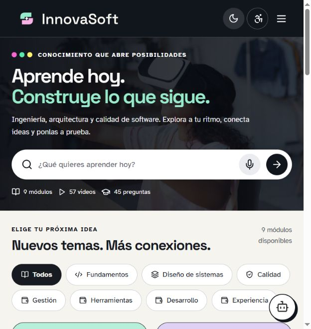
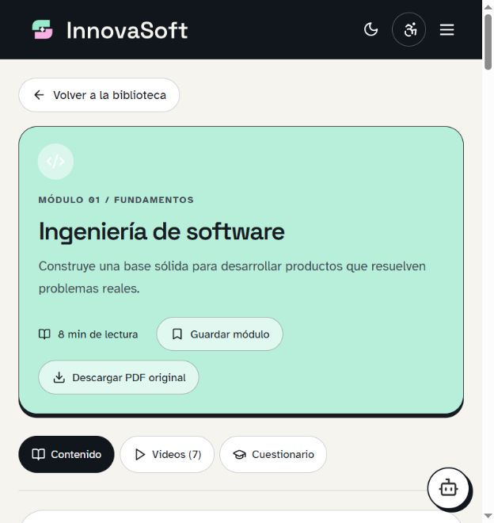
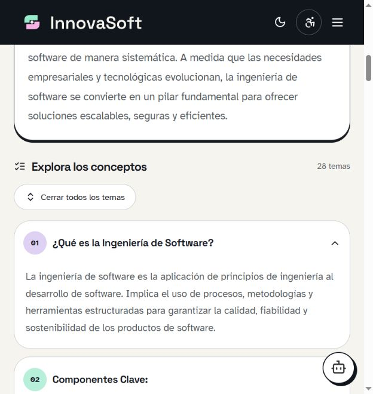
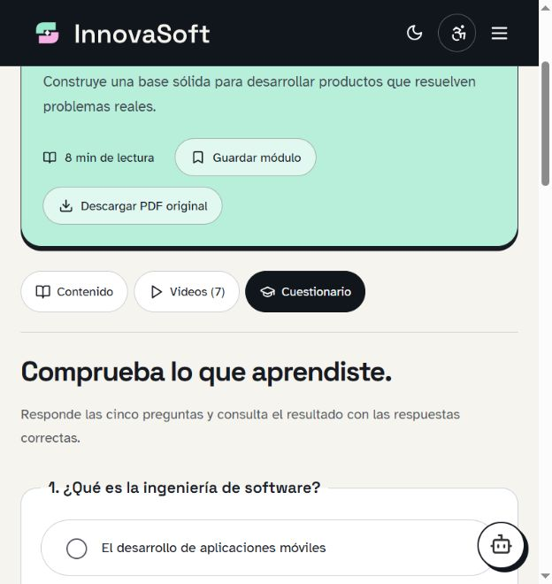
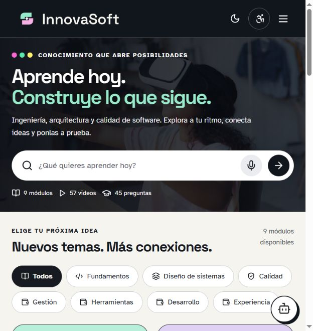
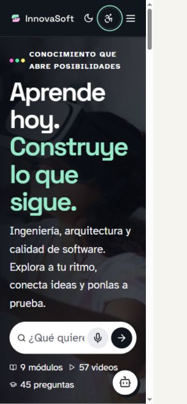
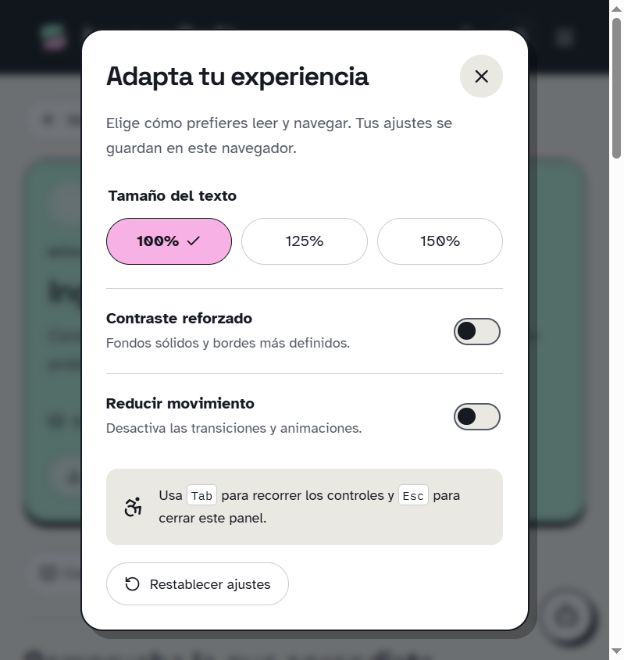
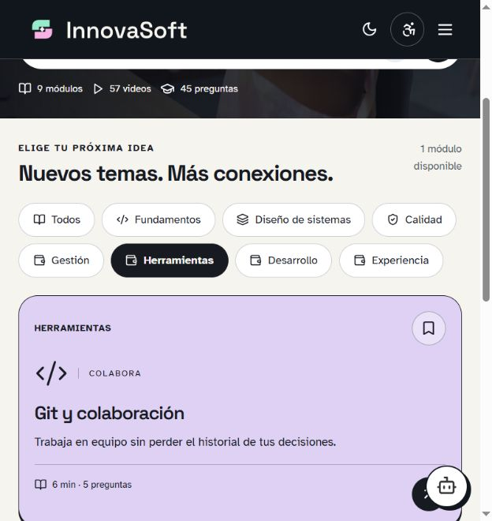
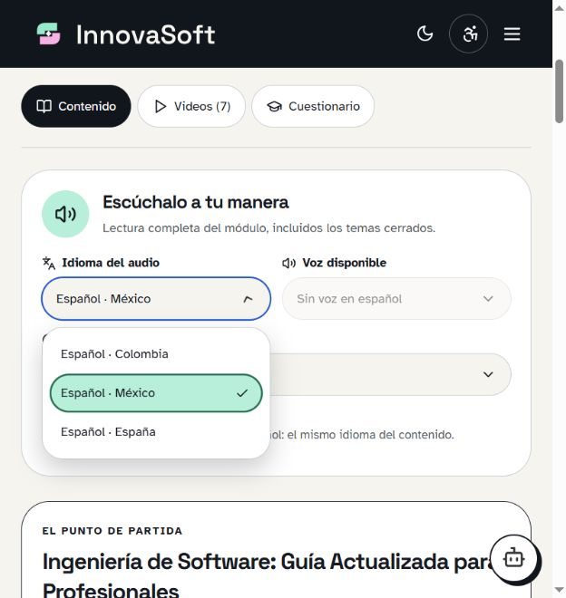

# InnovaSoft

Una biblioteca para conectar ideas de ingeniería, arquitectura y calidad de software. Conserva los cinco módulos originales y su identidad: fotografía de realidad virtual, isologo integrado, formas redondas y acentos rosa, menta y amarillo.

**[Abrir la aplicación](https://analizajech.github.io/InnovaSoft/)** · [Validación de accesibilidad](docs/ACCESSIBILITY.md)



## Recorrido del sistema

GIF elaborado a partir de capturas reales: biblioteca → filtros → guardados → módulo → audio → conceptos → cuestionario → accesibilidad → tema oscuro.


## Aprende a tu manera

- **Nueve módulos**, 57 videos originales, 45 preguntas y cinco PDFs originales. Los cuatro nuevos módulos incluyen documentación, audio, retos y evaluación.
- Buscador que ignora acentos y consulta todo el contenido, filtros por categoría y búsqueda por voz en navegadores compatibles.
- Conceptos organizados en temas desplegables, listas visuales, iconos y retos prácticos con fuentes primarias.
- Lectura completa por fragmentos cortos: idioma regional, voz disponible y velocidad ajustables. El audio incluye los temas cerrados y se detiene al cambiar la configuración o salir de la lectura.
- Guardados, avance, puntuación y perfil local persistentes en el navegador.
- Tema claro y oscuro, texto al 100/125/150%, contraste reforzado, movimiento reducido y navegación con teclado.
- Una barra superior de navegación; el panel del módulo comienza debajo de ella y pasa al flujo normal en móvil.

## Contenido y controles







## Móvil y accesibilidad

<p>
  
  
</p>



## Nuevos temas

- Git y colaboración: commits, ramas, revisión y conflictos. [Pro Git](https://git-scm.com/book/en/v2/Getting-Started-About-Version-Control).
- Web, HTTP y APIs: peticiones, métodos, estados y contratos. [MDN](https://developer.mozilla.org/en-US/docs/Web/HTTP/Guides/Overview).
- UX y accesibilidad: investigación, teclado, alternativas y evaluación. [MDN](https://developer.mozilla.org/en-US/docs/Learn_web_development/Core/Accessibility).
- Seguridad de aplicaciones: permisos, entradas, secretos y dependencias. [OWASP](https://owasp.org/projects/top-ten).



Son introducciones educativas con ejercicios; los cinco módulos originales y sus recursos se conservan.

## Audio e idiomas




El material está escrito en **español**. El selector permite español de Colombia, México o España; no traduce el contenido a otros idiomas. La lectura busca una voz de la región seleccionada, permite elegir otra voz en español y recuerda la velocidad.

Las voces provienen del navegador y del dispositivo. Si no existe la variante regional, se informa de la voz en español disponible. Si no hay ninguna voz en español, se muestra un aviso y no se reproduce el contenido con una voz de otro idioma. La búsqueda por voz utiliza la misma preferencia regional. No hay reproducción automática.

## Identidad visual

<picture>
  <source media="(prefers-color-scheme: dark)" srcset="public/src/innovasoft-isologo-dark.png" />
  
</picture>

Marca vectorial integrada y favicon simplificado. Fuentes alojadas localmente: Space Grotesk para títulos, Atkinson Hyperlegible para lectura e IBM Plex Mono para código. Consulta la [guía de marca](docs/BRAND.md) para colores, licencias, archivos, reglas de uso y briefs de diseño.

## Desarrollo

React 19, TypeScript, Vite y Lucide. Node.js 22.12 o una versión posterior compatible con Vite.

```sh
npm ci
npm run dev
npm test
npm run build
npm run preview
```

La interfaz es una aplicación React 19 escrita en TypeScript y compilada por Vite. La navegación usa rutas `#/library`, `#/saved`, `#/progress`, `#/space` y `#/learn/:id`, sin recargar entre vistas. Estas rutas funcionan en GitHub Pages sin reglas de servidor. Los HTML antiguos son entradas de compatibilidad que redirigen a la aplicación.

El catálogo se extiende en `app/extra-courses.json`; no exige duplicar páginas ni componentes. Los conteos, filtros, búsqueda, guardados y progreso se calculan a partir del catálogo.

## Verificación

Seis pruebas automatizadas cubren la conservación de recursos, búsqueda, puntuación, selección de voz e integridad de la lectura por fragmentos. Se verificaron en el navegador los filtros, guardados, progreso, cuestionario con correcciones, guía local, validación de nombre, cierre de diálogos por teclado y adaptación a pantallas pequeñas.

La revisión con axe-core no detectó infracciones en los cinco módulos con contenido expandido, la biblioteca y el panel de accesibilidad. Algunos contrastes sobre fotografías requieren revisión manual. Esto no constituye una certificación WCAG; consulta el [alcance y las evidencias](docs/ACCESSIBILITY.md).

## Publicación

El workflow `.github/workflows/pages.yml` ejecuta pruebas, compila y publica `dist` al actualizar `master`. GitHub Pages utiliza **GitHub Actions** como origen. Los archivos fuente necesitan compilación.

## Estructura

| Archivo                      | Responsabilidad                                   |
| ---------------------------- | ------------------------------------------------- |
| `app/Library.tsx`            | Biblioteca, filtros, guardados y progreso         |
| `app/Lesson.tsx`             | Módulo, videos y cuestionario                     |
| `app/ArticleContent.tsx`     | Presentación visual del contenido original        |
| `app/AudioReader.tsx`        | Controles y ciclo de lectura por voz              |
| `app/speech.js`              | Selección de voz y división de texto, con pruebas |
| `app/AccessibilityPanel.tsx` | Ajustes de lectura y movimiento                   |
| `app/Modal.tsx`              | Diálogos nativos y navegación por teclado         |
| `app/courses.json`           | Artículos, videos y preguntas originales          |
| `app/updates.ts`             | Ampliaciones y fuentes primarias                  |
| `public/PDF`                 | Documentos originales descargables                |
| `docs/media`                 | Capturas reales y GIF del sistema                 |

`scripts/migrate.mjs` regenera el contenido desde el commit original `27c4433`. `scripts/create-demo.py` reconstruye el GIF desde las capturas con Pillow; no forma parte de la aplicación.

## Límites del producto

El perfil es local: no existe autenticación ni sincronización entre dispositivos. Jech orienta sobre los recursos de la biblioteca mediante respuestas locales. La disponibilidad de videos depende de YouTube y la de voces depende del dispositivo. Los PDFs mantienen el contenido original; las ampliaciones aparecen en la aplicación.

## Fuentes de ampliación

- [W3C · WCAG 2.2](https://www.w3.org/TR/WCAG22/)
- [ISO · ISO/IEC 25010](https://www.iso.org/standard/78176.html)
- [Google SRE · Implementing SLOs](https://sre.google/workbook/implementing-slos/)
- [FinOps Foundation · Framework](https://www.finops.org/framework/)
